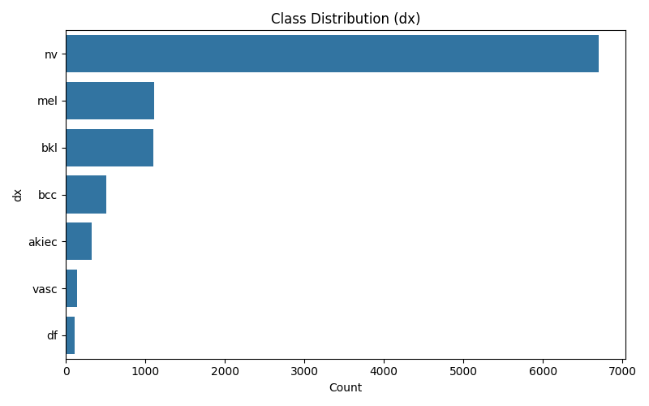
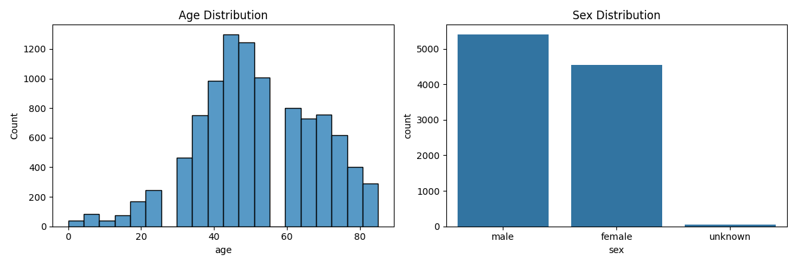
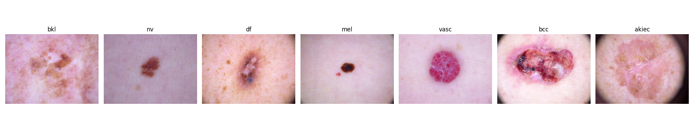

# 🔬 Data & Preprocessing Pipeline Documentation

> **Role:** Data & Preprocessing Lead  
> **Project:** Skin Disease Classification (HAM10000)  
> **Author:** Data & Preprocessing Lead  
> **Last Updated:** August 2026

---

## 📋 Table of Contents

1. [Overview](#overview)
2. [Dataset Description](#dataset-description)
3. [Pipeline Architecture](#pipeline-architecture)
4. [Module 1 — data_preprocessing.py](#module-1--data_preprocessingpy)
5. [Module 2 — dataset.py](#module-2--datasetpy)
6. [Execution Results](#execution-results)
7. [EDA Visualizations](#eda-visualizations)
8. [Class Imbalance Analysis](#class-imbalance-analysis)
9. [Data Splits Summary](#data-splits-summary)
10. [Augmentation Strategy](#augmentation-strategy)
11. [Dependencies](#dependencies)
12. [How to Run](#how-to-run)

---

## Overview

This preprocessing pipeline prepares the **HAM10000** (Human Against Machine with 10,000 training images) dataset for a multi-class skin disease classification model. It handles:

- ✅ Dataset download from Kaggle
- ✅ Metadata cleaning & missing value imputation
- ✅ Exploratory Data Analysis (EDA) with saved plots
- ✅ Class imbalance analysis with computed weights
- ✅ Lesion-aware stratified train/val/test splitting
- ✅ PyTorch Dataset class with augmentation pipelines

---

## Dataset Description

| Property | Value |
|----------|-------|
| **Name** | HAM10000 |
| **Source** | [Kaggle - Skin Cancer MNIST](https://www.kaggle.com/datasets/kmader/skin-cancer-mnist-ham10000) |
| **Total Images** | 10,015 |
| **Unique Lesions** | 7,470 |
| **Image Format** | `.jpg` (dermatoscopic images) |
| **Resolution** | 600×450 px (original) |
| **Classes** | 7 skin lesion types |

### Disease Classes

| Code | Full Name | Category |
|------|-----------|----------|
| `nv` | Melanocytic nevi | Benign |
| `mel` | Melanoma | **Malignant** ⚠️ |
| `bkl` | Benign keratosis | Benign |
| `bcc` | Basal cell carcinoma | **Malignant** ⚠️ |
| `akiec` | Actinic keratoses | Pre-malignant |
| `vasc` | Vascular lesions | Benign |
| `df` | Dermatofibroma | Benign |

---

## Pipeline Architecture

```
┌─────────────────────────────────────────────────────────────┐
│                    PREPROCESSING PIPELINE                   │
├─────────────────────────────────────────────────────────────┤
│                                                             │
│  ┌──────────────┐    ┌──────────────┐    ┌──────────────┐   │
│  │   Download    │───▶│  Clean &     │───▶│     EDA      │   │
│  │   Dataset     │    │  Impute      │    │    Plots     │   │
│  └──────────────┘    └──────────────┘    └──────────────┘   │
│                                                │            │
│                                                ▼            │
│  ┌──────────────┐    ┌──────────────┐    ┌──────────────┐   │
│  │  Train/Val/   │◀──│   Stratified  │◀──│   Class      │   │
│  │  Test CSVs    │   │   Splitting   │    │  Weights     │   │
│  └──────────────┘    └──────────────┘    └──────────────┘   │
│         │                                                   │
│         ▼                                                   │
│  ┌──────────────────────────────────────────────────┐       │
│  │           PyTorch HAM10000Dataset                 │       │
│  │  ┌─────────────┐         ┌─────────────┐         │       │
│  │  │   Train     │         │  Val/Test   │         │       │
│  │  │ Augmented   │         │ Eval Only   │         │       │
│  │  └─────────────┘         └─────────────┘         │       │
│  └──────────────────────────────────────────────────┘       │
│                                                             │
└─────────────────────────────────────────────────────────────┘
```

---

## Module 1 — `data_preprocessing.py`

**Purpose:** End-to-end data pipeline from raw download to analysis-ready splits.

### Constants

```python
RANDOM_STATE = 42                    # Reproducibility seed
DATA_DIR     = "ham10000"            # Raw dataset folder (or "data/raw")
OUTPUT_DIR   = "outputs"             # All generated files go here
```

### Function Breakdown

---

### `download_dataset()`

Downloads and extracts the HAM10000 dataset from Kaggle.

```python
def download_dataset():
    os.system("kaggle datasets download -d kmader/skin-cancer-mnist-ham10000")
    os.makedirs(DATA_DIR, exist_ok=True)
    os.system(f"unzip -q skin-cancer-mnist-ham10000.zip -d {DATA_DIR}")
```

> **⚡ Effect:** Creates `ham10000/` directory with `HAM10000_metadata.csv`, `HAM10000_images_part_1/`, and `HAM10000_images_part_2/`

---

### `load_and_clean_metadata()`

Loads the metadata CSV, handles missing values, and maps image file paths.

```python
def load_and_clean_metadata():
    meta = pd.read_csv(os.path.join(DATA_DIR, "HAM10000_metadata.csv"))
    
    # Impute missing ages with median
    meta["age"] = meta["age"].fillna(meta["age"].median())
    
    # Build image_id → file path mapping
    img_paths = {
        os.path.splitext(os.path.basename(p))[0]: p
        for p in glob.glob(os.path.join(DATA_DIR, "*", "*.jpg"))
    }
    meta["path"] = meta["image_id"].map(img_paths)
    meta = meta.dropna(subset=["path"]).reset_index(drop=True)
    meta["dx_full"] = meta["dx"].map(DX_FULL_NAMES)
```

> **⚡ Effects:**
> - 57 missing `age` values → imputed with **median**
> - Adds `path` column linking each row to its `.jpg` file
> - Adds `dx_full` column with human-readable disease names
> - Drops rows with unmapped images
> - **Result:** 10,015 images, 7,470 unique lesions

---

### `run_eda(meta)`

Generates and saves three EDA visualization plots.

| Plot | Description | Output File |
|------|-------------|-------------|
| Class Distribution | Horizontal bar chart of diagnosis counts | `class_distribution.png` |
| Age & Sex | Histogram + bar chart side-by-side | `age_sex_distribution.png` |
| Sample Images | One example image per class | `sample_images_per_class.png` |

```python
def run_eda(meta, save_dir=OUTPUT_DIR):
    # Plot 1: Class distribution bar chart
    sns.countplot(data=meta, y="dx", order=meta["dx"].value_counts().index)
    
    # Plot 2: Age histogram + Sex bar chart
    sns.histplot(meta["age"], bins=20, ax=axes[0])
    sns.countplot(data=meta, x="sex", ax=axes[1])
    
    # Plot 3: One sample image per disease class
    for ax, cls in zip(axes, meta["dx"].unique()):
        img = plt.imread(meta[meta["dx"] == cls]["path"].iloc[0])
        ax.imshow(img)
```

> **⚡ Effect:** Saves 3 PNG plots to `outputs/` directory

---

### `class_balance_analysis(meta)`

Computes class imbalance metrics and balanced weights for loss functions.

```python
def class_balance_analysis(meta, save_dir=OUTPUT_DIR):
    class_counts = meta["dx"].value_counts()
    imbalance_ratio = class_counts.max() / class_counts.min()
    
    # Compute sklearn balanced class weights
    weights = compute_class_weight("balanced", 
                                   classes=np.arange(len(classes)), 
                                   y=labels_int)
```

> **⚡ Effects:**
> - Computes **imbalance ratio: 58.3x** (nv vs df)
> - Generates balanced class weights using `sklearn.utils.class_weight`
> - Saves weights to `outputs/class_weights.json`

**Computed Class Weights:**

| Class | Weight | Interpretation |
|-------|--------|----------------|
| `df` | **12.44** | Heavily upweighted (rarest) |
| `vasc` | **10.08** | Heavily upweighted |
| `akiec` | **4.38** | Moderately upweighted |
| `bcc` | **2.78** | Moderately upweighted |
| `bkl` | **1.30** | Slightly upweighted |
| `mel` | **1.29** | Slightly upweighted |
| `nv` | **0.21** | Downweighted (most common) |

---

### `create_splits(meta)`

Creates train/validation/test splits **by lesion ID** (not by image) to prevent data leakage.

```python
def create_splits(meta, save_dir=OUTPUT_DIR, test_size=0.30, val_ratio=0.50):
    lesion_df = meta.drop_duplicates("lesion_id")[["lesion_id", "dx"]]
    
    # First split: 70% train, 30% temp
    train_ids, temp_ids = train_test_split(
        lesion_df, test_size=test_size, stratify=lesion_df["dx"],
        random_state=RANDOM_STATE
    )
    # Second split: 50/50 val/test from temp (= 15%/15% of total)
    val_ids, test_ids = train_test_split(
        temp_ids, test_size=val_ratio, stratify=temp_ids["dx"],
        random_state=RANDOM_STATE
    )
```

> **⚡ Key Design Decision:** Splitting by `lesion_id` ensures the **same skin lesion never appears in both training and testing**, preventing data leakage.

**Split Ratios:**

```
Total Lesions ──▶ 70% Train ──▶ 7,002 images
              └──▶ 15% Val   ──▶ 1,532 images
              └──▶ 15% Test  ──▶ 1,481 images
```

> **⚡ Effect:** Creates `train_split.csv`, `val_split.csv`, `test_split.csv` in `outputs/`

---

## Module 2 — `dataset.py`

**Purpose:** PyTorch-compatible Dataset class with train/eval augmentation pipelines.

### Augmentation Pipelines

#### 🔄 Train Transform (data augmentation)

```python
train_transform = A.Compose([
    A.Resize(224, 224),           # Resize to model input size
    A.HorizontalFlip(p=0.5),     # 50% chance horizontal flip
    A.VerticalFlip(p=0.5),       # 50% chance vertical flip
    A.Rotate(limit=30, p=0.7),   # ±30° rotation, 70% chance
    A.ColorJitter(               # Color augmentation, 50% chance
        brightness=0.2, contrast=0.2,
        saturation=0.2, hue=0.1, p=0.5
    ),
    A.Normalize(                 # ImageNet normalization
        mean=(0.485, 0.456, 0.406),
        std=(0.229, 0.224, 0.225)
    ),
    ToTensorV2(),                # Convert to PyTorch tensor
])
```

> **⚡ Effect:** Artificially increases training data diversity to reduce overfitting on the imbalanced dataset.

#### 📐 Eval Transform (no augmentation)

```python
eval_transform = A.Compose([
    A.Resize(224, 224),           # Same resize
    A.Normalize(mean=..., std=...),  # Same normalization
    ToTensorV2(),                 # Same tensor conversion
])
```

> **⚡ Effect:** Deterministic preprocessing — no randomness during validation/testing.

### `HAM10000Dataset` Class

```python
class HAM10000Dataset(Dataset):
    def __init__(self, df, transform=None):
        self.df = df.reset_index(drop=True)
        self.classes = sorted(df["dx"].unique())
        self.class_to_idx = {c: i for i, c in enumerate(self.classes)}
    
    def __getitem__(self, idx):
        img = cv2.imread(row["path"])      # Read BGR image
        img = cv2.cvtColor(img, cv2.COLOR_BGR2RGB)  # Convert to RGB
        label = self.class_to_idx[row["dx"]]         # Map class → int
        img = self.transform(image=img)["image"]     # Apply transforms
        return img, label
```

> **⚡ Effects:**
> - Reads images with OpenCV (BGR → RGB conversion)
> - Maps string labels to integer indices: `akiec=0, bcc=1, bkl=2, df=3, mel=4, nv=5, vasc=6`
> - Returns `(tensor, label)` tuples compatible with PyTorch `DataLoader`

---

## Execution Results

### Console Output

```
Missing values before cleaning:
lesion_id        0
image_id         0
dx               0
dx_type          0
age             57
sex              0
localization     0
dtype: int64

Final dataset: 10015 images, 7470 unique lesions
EDA plots saved to outputs/

Imbalance ratio (majority/minority): 58.3
dx
nv       66.95
mel      11.11
bkl      10.97
bcc       5.13
akiec     3.27
vasc      1.42
df        1.15
Name: count, dtype: float64

Class weights: {
  'akiec': 4.375,  'bcc': 2.783,  'bkl': 1.302,
  'df': 12.441,    'mel': 1.285,  'nv': 0.213,
  'vasc': 10.075
}

Train: 7002 | Val: 1532 | Test: 1481
Preprocessing complete. Outputs saved to: outputs
```

### Dataset Loader Verification

```
Train dataset size: 7002
Val dataset size: 1532
Classes: ['akiec', 'bcc', 'bkl', 'df', 'mel', 'nv', 'vasc']
```

---

## EDA Visualizations

### Class Distribution


### Age & Sex Distribution


### Sample Images Per Class


---

## Class Imbalance Analysis

The dataset is **severely imbalanced** with a 58.3x ratio between the most and least common classes.

```
  ████████████████████████████████████████████████░░░░░░░  nv     6,705 (66.95%)
  ████████░░░░░░░░░░░░░░░░░░░░░░░░░░░░░░░░░░░░░░░░░░░░░  mel    1,113 (11.11%)
  ███████░░░░░░░░░░░░░░░░░░░░░░░░░░░░░░░░░░░░░░░░░░░░░░  bkl    1,099 (10.97%)
  ███░░░░░░░░░░░░░░░░░░░░░░░░░░░░░░░░░░░░░░░░░░░░░░░░░░  bcc      514 ( 5.13%)
  ██░░░░░░░░░░░░░░░░░░░░░░░░░░░░░░░░░░░░░░░░░░░░░░░░░░░  akiec    327 ( 3.27%)
  █░░░░░░░░░░░░░░░░░░░░░░░░░░░░░░░░░░░░░░░░░░░░░░░░░░░░  vasc     142 ( 1.42%)
  █░░░░░░░░░░░░░░░░░░░░░░░░░░░░░░░░░░░░░░░░░░░░░░░░░░░░  df       115 ( 1.15%)
```

### Mitigation Strategy
The pipeline computes **balanced class weights** saved to `class_weights.json`. These weights should be used in the loss function during training to counteract the imbalance:

```python
# Example usage in training
criterion = nn.CrossEntropyLoss(weight=torch.tensor(list(class_weights.values())))
```

---

## Data Splits Summary

| Split | Images | % of Total | Purpose |
|-------|--------|------------|---------|
| **Train** | 7,002 | 69.9% | Model training with augmentation |
| **Val** | 1,532 | 15.3% | Hyperparameter tuning, early stopping |
| **Test** | 1,481 | 14.8% | Final unbiased evaluation |

### Distribution Preservation Across Splits

| Class | Train | Val | Test |
|-------|-------|-----|------|
| nv | 0.668 | 0.675 | 0.670 |
| mel | 0.111 | 0.111 | 0.111 |
| bkl | 0.111 | 0.102 | 0.113 |
| bcc | 0.052 | 0.050 | 0.048 |
| akiec | 0.033 | 0.033 | 0.031 |
| vasc | 0.014 | 0.016 | 0.013 |
| df | 0.011 | 0.012 | 0.014 |

> ✅ Class proportions are well-preserved across all splits thanks to stratified splitting.

---

## Augmentation Strategy

| Augmentation | Parameter | Probability | Rationale |
|-------------|-----------|-------------|-----------|
| **Resize** | 224×224 | 100% | Standard input for ResNet/EfficientNet |
| **HorizontalFlip** | — | 50% | Skin lesions have no preferred orientation |
| **VerticalFlip** | — | 50% | Same rationale as horizontal |
| **Rotation** | ±30° | 70% | Dermoscopic images taken at varying angles |
| **ColorJitter** | B=0.2, C=0.2, S=0.2, H=0.1 | 50% | Simulates lighting/device variations |
| **Normalize** | ImageNet stats | 100% | Required for pretrained backbone transfer |

---

## Dependencies

```
pandas          — metadata loading & manipulation
numpy           — numerical operations
matplotlib      — plot generation
seaborn         — statistical visualizations
scikit-learn    — train_test_split, class weights
opencv-python   — image loading (cv2)
albumentations  — augmentation pipeline
torch           — PyTorch Dataset class
```

---

## How to Run

```bash
# 1. Activate virtual environment
.venv\Scripts\Activate.ps1          # Windows PowerShell
# source .venv/bin/activate         # Linux/Mac

# 2. Run preprocessing pipeline
python src/data_preprocessing.py

# 3. Verify dataset loading
python src/dataset.py
```

### Output Files Generated

```
outputs/
├── train_split.csv              # 7,002 rows — training data
├── val_split.csv                # 1,532 rows — validation data
├── test_split.csv               # 1,481 rows — test data
├── class_weights.json           # balanced weights for loss function
├── class_distribution.png       # EDA: class bar chart
├── age_sex_distribution.png     # EDA: age & sex plots
└── sample_images_per_class.png  # EDA: sample images
```

---

> **📌 Note for Modeling Lead:** Use `dataset.py`'s `HAM10000Dataset` class with `train_transform` for training and `eval_transform` for validation/testing. Class weights are available in `outputs/class_weights.json`.
